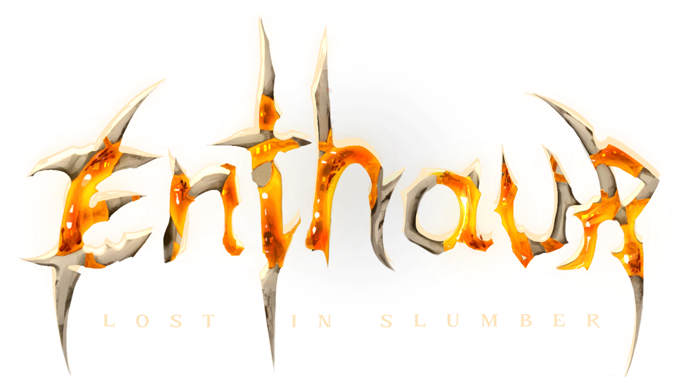
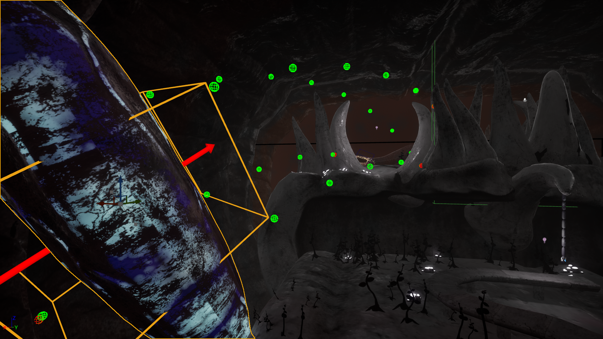
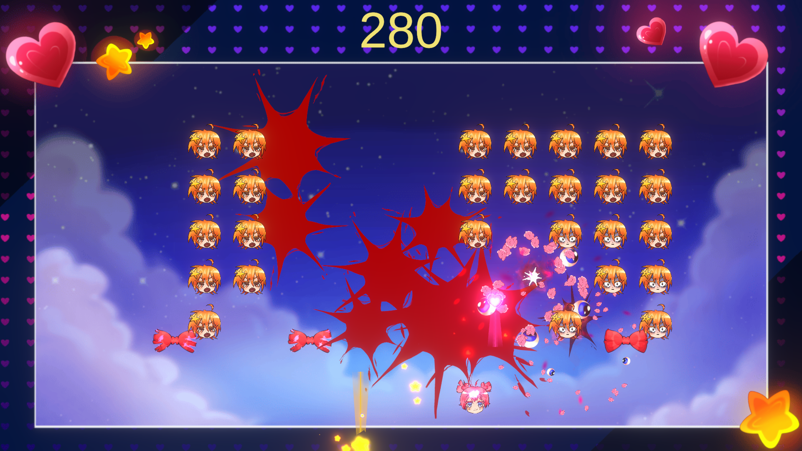
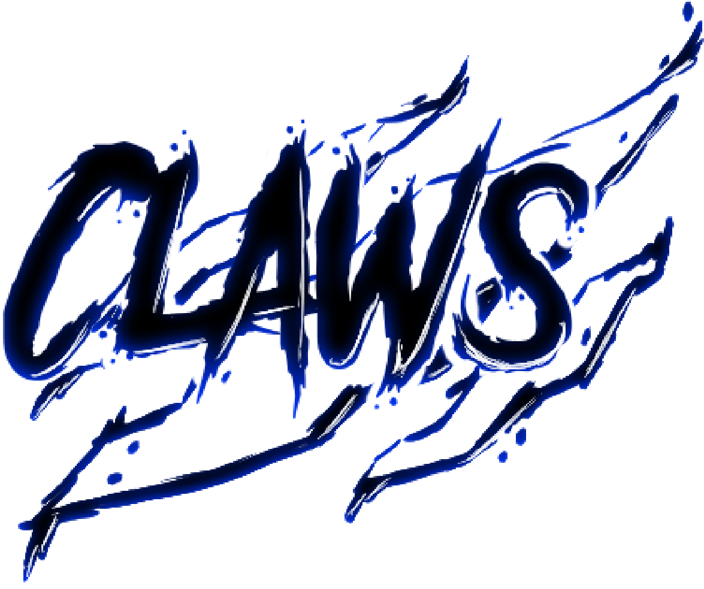

# Index <!-- omit from toc -->
- [EnThaur - Lost In Slumber](#enthaur---lost-in-slumber)
- [Modus Operandi](#modus-operandi)
- [Juicinvaders](#juicinvaders)
- [Glitch](#glitch)
- [Claws](#claws)
- [TransHarmony](#transharmony)
- [Hirisalla](#hirisalla)

# EnThaur - Lost In Slumber

  

- Projet Unreal Engine 5 - C++ et Blueprint
- Équipe de 13 personnes
- Gameplay Programmer
- En cours de développement (Débuté en Janvier 2025)

> EnThaur - Lost In Slumber est un jeu d'aventure-plateforme à la 1ère personne qui se déroule dans le corps d'un géant. Le géant étant en train de mourir, le joueur va être amené à parcourir ses différents membres pour les réanimer et utiliser nerfs, muscles et ambre (sang du géant) pour progresser à l'intérieur du corps.

J'ai travaillé sur la physique des nerfs, qui permettent de se propulser pour atteindre des plateformes inaccessibles. Le joueur doit les déplacer et interagir avec l'environnement pour agir sur l'angle et la direction de propulsion. Il s'agit d'une spline à laquelle on associe une série de meshes (Instanced Static Meshes). Le check de collisions se fait avec 2 LineTraces et un produit scalaire.  
  

J'ai également travaillé sur les muscles, élément du jeu qui permet au joueur de rebondir si le muscle est mou ou de s'en servir comme plateforme si le muscle est dur. Pour le rebond, le muscle change l'état du pawn vers un FallState avec une force de propulsion en fonction du UpVector du mesh.  
  

Ainsi qu'un tool de debug pour que les designers puissent correctement gérer la propulsion du muscle.  
  

- Pas de liens de téléchargement  
- [Repository de EnThaur - Lost In Slumber](https://github.com/KaitoOwU/-PROTO-PFE-Profondeurs)  

# Modus Operandi

  

- Projet VR Unreal Engine 5 - C++ et Blueprint
- Équipe de 13 personnes
- Gameplay Programmer
- 2 semaines

> Un projet pour tester les possibilités de la VR sur Unreal. Le jeu se veut angoissant et place le joueur face à une foule qu'il doit traverser à contre-sens.

J'ai codé le système de world infini ainsi qu’un système d'obstacles qui écarte la foule.  
  

- [Télécharger Modus Operandi](https://github.com/AeroPorc/UnrealVR/releases/download/v1.0/ModusOperandi.zip)  
- [Repository de Modus Operandi](https://github.com/AeroPorc/UnrealVR)  

# Juicinvaders

- Projet Unity - C#
- Équipe de 8 personnes
- 4 jours

> Petit jeu de jam qui avait pour but de réaliser le space invader le + juicy possible avec 3 mots clé pour définir la direction du projet (les nôtres étant : léger, choqué et dérangé). Le jeu se veut de prime abord mignon et enfantin, puis dans un second temps gore et décalé.

Sur ce projet j'ai surtout fait de l'intégrations d'assets et certaines animations.  
  

- [Télécharger Juicinvaders](https://github.com/DanZo0x/PJ_Juiciness/releases/download/v1.0/Juicinvaders.zip)  
- [Repository de Juicinvaders](https://github.com/DanZo0x/PJ_Juiciness)  

# Glitch

  

- Projet Unreal Engine 4 - C++ et Blueprint
- Équipe de 6 personnes
- Gameplay Programmer 3C et IA
- Octobre 2022 - Juin 2023

> Glitch est un tower defense - infiltration sur PC dans lequel le joueur incarne un personnage à la 3ᵉ personne qui évolue au sein de son monde médiéval corrompu par un vide étrange. Le combat entre cette corruption et ce monde engendre des singularités affectant tout l’univers. Le joueur devra ainsi progresser en s'infiltrant au sein du territoire corrompu, pour identifier les infrastructures clés et les capturer. Lorsque le joueur décidera que son objectif est rempli, il devra survivre aux vagues ennemies qui lui seront opposées en générant ses propres défenses.

J'ai codé toutes les fonctionnalités de l'avatar et des IA du jeu.

La mécanique du Glitch Dash, une sorte de téléportation vers un point défini au préalable par le joueur.  
Il s'agit simplement d'une interpolation de positions. Tout ce que le joueur va traverser au cours de ce dash fera augmenter une jauge (nommée jauge de glitch) qui aura des impacts sur différents éléments comme les ennemis ou les tourelles.  

Dans Glitch pour se défendre contre les vagues ennemis, le joueur va devoir placer des pièges et des tourelles. Ces deux éléments héritent d'une même classe "PlacableObjects", et chaque Tourelle et piège ont leurs propre classe avec leurs propre comportement. Le placement des objets se fait sur des zones pré-définies.  

Les IA suivent un chemin principal en bleu qui les guident vers la structure que le joueur doit défendre. Mais elles peuvent se déplacer partout, notamment pour suivre le joueur si il entre dans leurs champs de vision. Si les IA se rapprochent trop du joueur, elles l'attaquent.  

- [Trailer du jeu](https://youtu.be/VLsZSiRM8KA)  
- [Télécharger Glitch](https://github.com/MichenaudMelvin/Glitch/releases/latest)  
- [Repository de Glitch](https://github.com/MichenaudMelvin/Glitch)  

# Claws

  

- Projet Unreal Engine 4 - Blueprint uniquement
- Équipe de 5 Personnes
- Gameplay Programmer 3C et IA
- Mars 2022 - Juin 2022

> Claws est un survival horror sur PC où l'on incarne un randonneur qui s'aventure dans une grotte non référencée dans laquelle il découvre des bâtiments scientifiques délabrés. Cependant, une entité monstrueuse habite les lieux et le traquera au moindre bruit. Il devra trouver un moyen de vous échapper vivant.

J'ai principalement codé l'IA du jeu, qui est une créature aveugle mais qui possède une ouïe surdéveloppée. L'IA devait donc réagir aux sons du jeu et du joueur. J'ai utilisé le composant natif AIPerception d'UE4.  

- [Télécharger Claws](https://github.com/MichenaudMelvin/Claws/releases/download/Beta/Claws.zip)  
- [Repository de Claws](https://github.com/MichenaudMelvin/Claws)  

# TransHarmony

  

- Projet Unity - C#
- Équipe de 8 personnes
- Gameplay Programmer UI
- 2 Semaines

> TransHarmony est un jeu mobile de gestion réalisé en partenariat avec le festival des [TransMusicales](https://www.lestrans.com/). On y incarne les organisateurs du festival, leurs but est de répondre aux besoins des différents artistes pour que leurs concerts se déroulent au mieux. Le gameplay est simple, pour répondre à un besoin il suffit de faire glisser une icône sur le besoin de l'artiste.

- [Télécharger TransHarmony](https://github.com/MichenaudMelvin/TransHarmony/releases/download/EdulabPresentation/TransHarmony_PC.zip)  
- [Repository de TransHarmony](https://github.com/MichenaudMelvin/TransHarmony)  

# Hirisalla

- Projet Renpy - Python
- Équipe de 8 personnes
- 4 jours

> Une Game jam de visual novel avec pour thème une romance. Le jeu se déroule dans un univers de fantasy où l'on suit les aventures de Edalla la sirène et Hiris l'elf.

J'ai codé les embranchements narratifs ainsi que les différentes poses et animations des personnages du jeu.  

- [Télécharger Hirisalla](https://github.com/MichenaudMelvin/Hirisalla/releases/download/v1.0/Hirisalla.zip)  
- [Repository de Hirisalla](https://github.com/MichenaudMelvin/Hirisalla)  