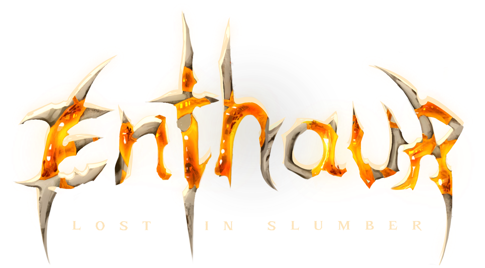
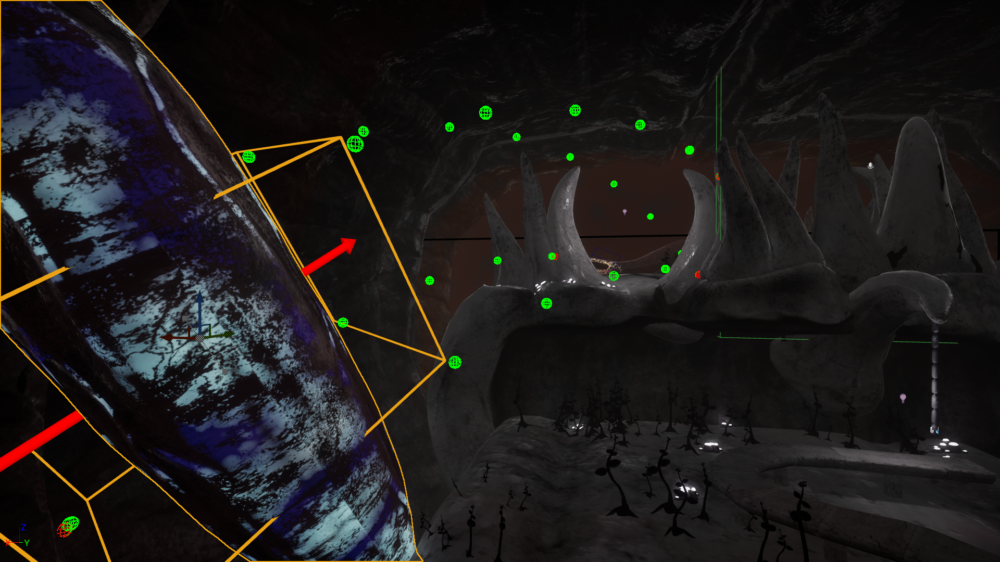
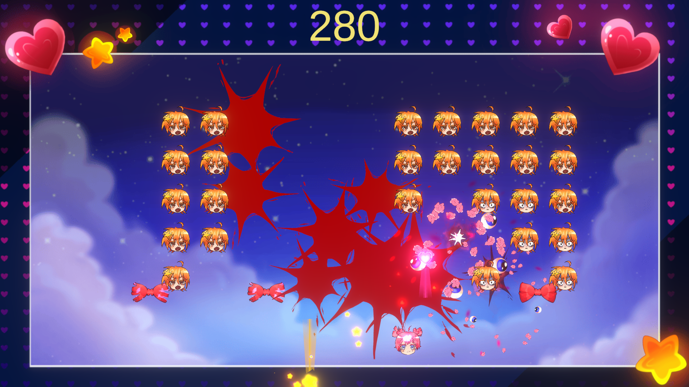
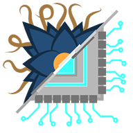
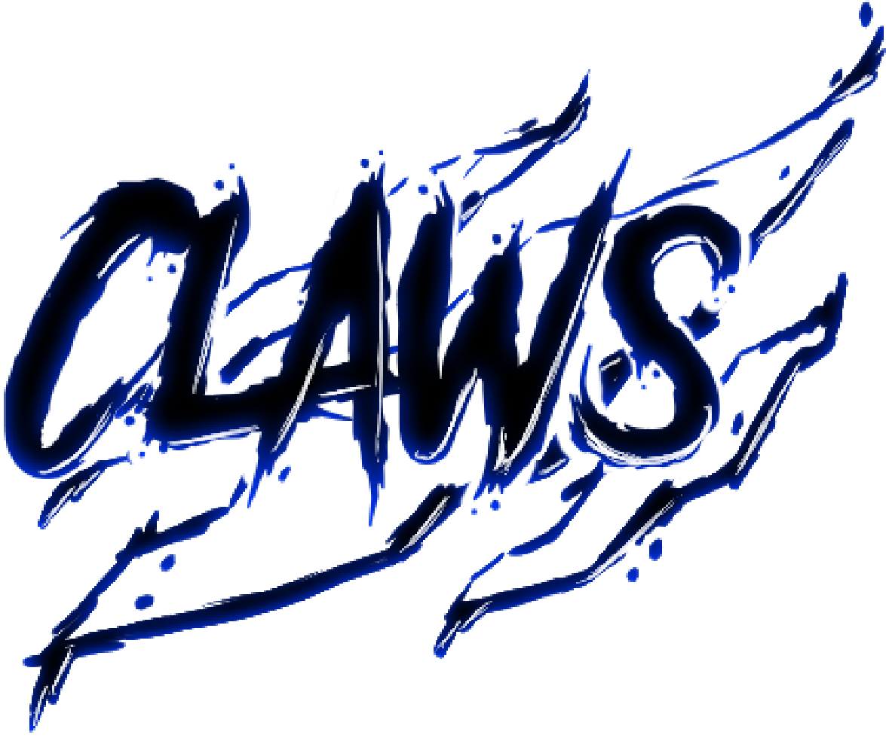
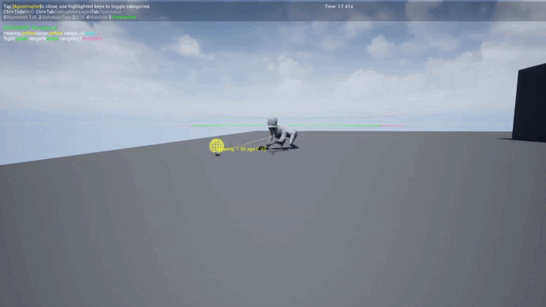
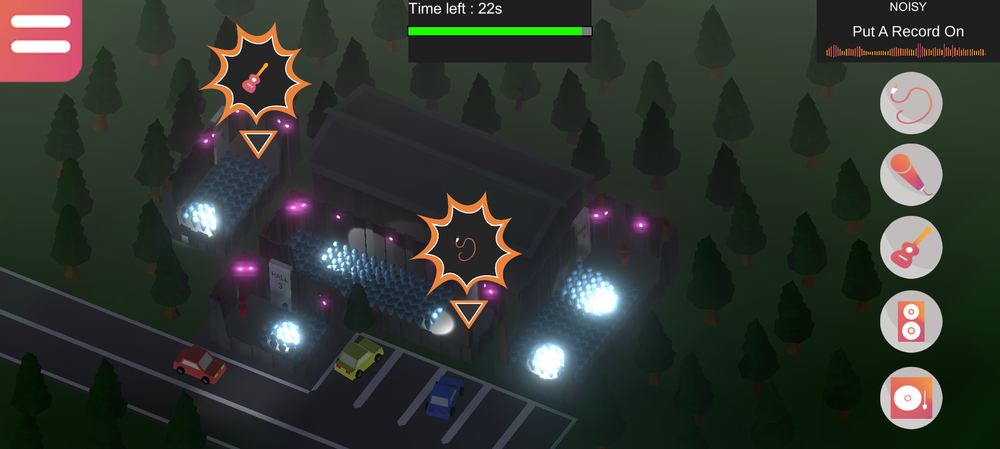

# Index <!-- omit from toc -->
- [EnThaur - Lost In Slumber](#enthaur---lost-in-slumber)
- [Modus Operandi](#modus-operandi)
- [Juicinvaders](#juicinvaders)
- [Glitch](#glitch)
- [Claws](#claws)
- [TransHarmony](#transharmony)
- [Hirisalla](#hirisalla)

# EnThaur - Lost In Slumber

  

- Unreal Engine 5 Project - C++ and Blueprint
- Team of 13 persons
- Gameplay Programmer
- Currently in development (Started in January 2025)

> EnThaur - Lost In Slumber is a 1st person adventure-platform game set in the body of a giant. As the giant is dying, the player will have to go through its different limbs to reanimate them and use nerves, muscles and amber (giant's blood) to progress inside the body.

I worked on the neves's physics, which allows to propel yourself to reach inaccessible platforms. The players must move them and interact with the environment to influence the angle and direction of the propulsion. It's a spline associated with a list a meshes (Instanced Static Meshes). The collision checking is made with 2 LineTraces and a dot product.  
  

I also worked on the muscles, an element of the game that allows the player to bounce on them if the muscle is soft or use them a as platform if they are hard. For the rebound, the muscle changes the current state of the pawn to a fall state with a propulsion force depending on the mesh's UpVector.  
  

And finally worked on a debug tool for the designers to correctly manage the muscle propulsion.  
  

- No download links  
- [EnThaur - Lost In Slumber repository](https://github.com/KaitoOwU/-PROTO-PFE-Profondeurs)  

# Modus Operandi

  

- Unreal Engine 5 VR Project - C++ and Blueprint
- Team of 13 persons
- Gameplay Programmer
- 2 weeks

> A project to test VR possibilities on Unreal. The game is meant to be nerve-wracking and places the player in front of a crowd that he must cross in the opposite direction.

I coded the infinite world system and an obstacle system that spreads the crowd.  
  

- [Download Modus Operandi](https://github.com/AeroPorc/UnrealVR/releases/download/v1.0/ModusOperandi.zip)  
- [Modus Operandi repository](https://github.com/AeroPorc/UnrealVR)  

# Juicinvaders

- Unity Project - C#
- Team of 8 persons
- 4 days

> A small jam game whose goal was to realize a the juiciest space invader possible with 3 key words to define the direction of the project (Our words was : light, choking and disturbed). The game is initially intended to be cute and childish and then gory and offbeat.

On this project I mainly worked on asset integration and some animations.
  

- [Download Juicinvaders](https://github.com/DanZo0x/PJ_Juiciness/releases/download/v1.0/Juicinvaders.zip)  
- [Juicinvaders repository](https://github.com/DanZo0x/PJ_Juiciness)  

# Glitch

  

- Unreal Engine 4 Project - C++ and Blueprint
- Team of 6 persons
- 3C and IA Programmer
- Octobrer 2022 - June 2023

> Glitch is a Tower Defense and Stealth game on PC where the player embodies a character to the 3rd person view. That character evolves within a medieval world corrupted by a strange void. Fighting this corruption generates singularities in the whole world. Players will have to progress quietly inside the corrupted world to identify key structures and capture them to bring back the world as it was. When the player finds his exploration is enough, he shall survive from multiple enemies incoming by creating his own defenses.

I coded every 3C and AI features of the game.

The Glitch Dash mechanic, a kind of teleportation towards a defined point in advance by the player.  
This is simply a linear interpolation of two locations. Everything the player will pass through during the dash will increase a gauge (named glitch gauge) which will impacts on differents elements such as enemies or turrets.  

In Glitch to defend against enemies waves, the player must place traps and turrets. Theses two elements inherit from the same base class named "PlacableObjects", and every turret and trap has their own class with their own behavior. The object placement is done in pre-defined areas.  

AI follow a main path (in blue) which guide them towards the structure the player must defend. But they can move everywhere, especially to follow the player if they enter in their sight. If the AI is close enough of the player, they attacked them.  

- [Trailer](https://youtu.be/VLsZSiRM8KA)  
- [Download Glitch](https://github.com/MichenaudMelvin/Glitch/releases/latest)  
- [Glitch repository](https://github.com/MichenaudMelvin/Glitch)  

# Claws

  

- Unreal Engine 4 Project - Blueprint only
- Team of 5 persons
- 3C and IA Programmer
- March 2022 - June 2022

> Claw is a survival horror on PC where we play as a hiker who ventures into an unreferenced cave in which he discovers dilapidated scientific buildings. However, a monstrous entity inhabits the place and will hunt him down at the slightest noise. He will have to find a way to escape you alive.

I mostly coded the AI of the game, who is a blind creature but own an overdeveloped hearing. The AI ​​therefore had to react to the sounds of the game and the player. I used the native AIPerception component from UE4.  

- [Download Claws](https://github.com/MichenaudMelvin/Claws/releases/download/Beta/Claws.zip)  
- [Claws repository](https://github.com/MichenaudMelvin/Claws)  

# TransHarmony

  

- Unity Project - C#
- Team of 8 persons
- UI Programmer
- 2 Weeks

> TransHarmony is a management mobile game executed in partnership with the french festival of the [TransMusicales](https://www.lestrans.com/). We play the organizers of the festival, their goals is to meet the needs of different artists so that their concerts go as smoothly as possible. The gameplay is simple, to meet a need just drag and drop an icon on the need of the artist.

- [Download TransHarmony](https://github.com/MichenaudMelvin/TransHarmony/releases/download/EdulabPresentation/TransHarmony_PC.zip)  
- [TransHarmony repository](https://github.com/MichenaudMelvin/TransHarmony)  

# Hirisalla

- Renpy Project - Python
- Team of 8 persons
- 4 days

> A visual novel game jam with a romance theme. The game takes place in a fantasy universe where we follow the adventures of Edalla the mermaid and Hiris the elf.

I made the narrative branches as well as the different poses and animations of the game's characters.  

- [Download Hirisalla](https://github.com/MichenaudMelvin/Hirisalla/releases/download/v1.0/Hirisalla.zip)  
- [Hirisalla repository](https://github.com/MichenaudMelvin/Hirisalla)  